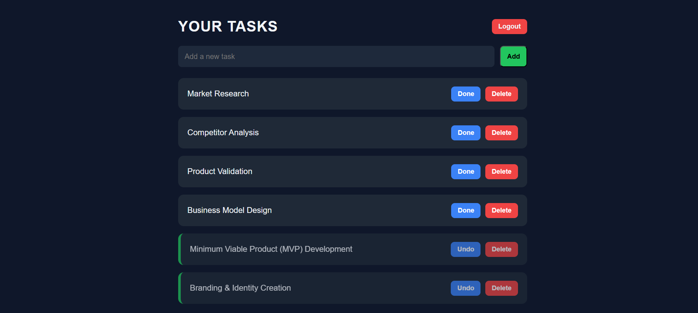
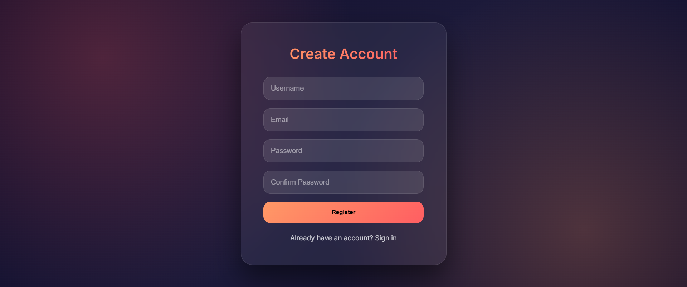

# 🚀 TaskFlow - Modern SaaS Task Management App


A modern, scalable **SaaS-ready Task Management Web Application** built with Flask, PostgreSQL, and Docker.

This project demonstrates production-style architecture including authentication, relational database design, modular blueprints, and a modern 2026-style UI/UX.

---

## 📸 Preview






---

# 🏗 Architecture Overview

```graphql
project/
│
├── app/
│ ├── init.py
│ ├── extensions.py
│ ├── models.py
│ ├── forms.py
│ │
│ ├── auth/
│ │ ├── init.py
│ │ └── routes.py
│ │
│ ├── main/
│ │ ├── init.py
│ │ └── routes.py
│ │
│ ├── templates/
│ └── static/
│
├── config.py
├── run.py
├── Dockerfile
├── docker-compose.yml
└── requirements.txt
```

---

---

# 🧠 Core Architecture Principles

## 🔹 Modular Blueprint Structure

The application is organized using Flask Blueprints to separate:

- Authentication logic
- Core task management
- UI rendering

This enables:

- Clean separation of concerns  
- Maintainability  
- Scalability  
- SaaS-ready backend structure  

---

## 🔹 PostgreSQL Database Persistence

The application uses:

- PostgreSQL  
- SQLAlchemy ORM  
- Relational data modeling  

Example model:

```python
class Task(db.Model):
    id = db.Column(db.Integer, primary_key=True)
    name = db.Column(db.String(200))
    done = db.Column(db.Boolean, default=False)
    user_id = db.Column(db.Integer, db.ForeignKey("user.id"))
```
### Benefits:
- Persistent relational storage
- User-specific task isolation
- Scalable database architecture
- Production-grade backend design

---
## 🔐 Authentication System

- User Registration
- Login / Logout
- Session Management
- Protected Routes

Each user only accesses their own tasks, making this app multi-user and SaaS-ready.

---

## 🎨 Modern 2026 UI/UX
The frontend features:

- Card-based layout
- Dark modern dashboard
- Smooth micro-interactions
- Clean typography
- Component-based styling

Inspired by modern productivity tools such as Notion, Linear, and Todoist.

---

## ✨ Features

- 🔐 Authentication
- ➕ Add Tasks
- ✅ Toggle Completion
- 🗑 Delete Tasks
- 👤 User-specific data isolation
- 🐳 Dockerized setup
- 🗄 PostgreSQL persistence
- 🧱 Modular architecture
- 🎨 Modern UI

---

## 🛠 Tech Stack

Backend:

- Python 3.11
- Flask
- SQLAlchemy
- Flask-Login
- PostgreSQL

Frontend:

- HTML5
- CSS3
- Vanilla JavaScript

Infrastructure:

- Docker
- Docker Compose

---

## 📚 Learning Outcomes

This project demonstrates:

- Flask Blueprints

- Authentication flow

- ORM modeling

- Relational databases

- Docker containerization

- Environment-based configuration

- Scalable project architecture

- SaaS-ready backend structure

---

### 🚀 Why This Project Matters

#### This is no longer a beginner todo app.

It is a foundation for:

- SaaS product development
- Startup MVP
- Multi-user web applications
- Backend architecture portfolio
---

### 👨‍💻 Author

Mohammadreza Hassani  
GitHub: `https://github.com/hassanimohammadreza`

---

### ⭐ If you found this project useful, consider giving it a star!